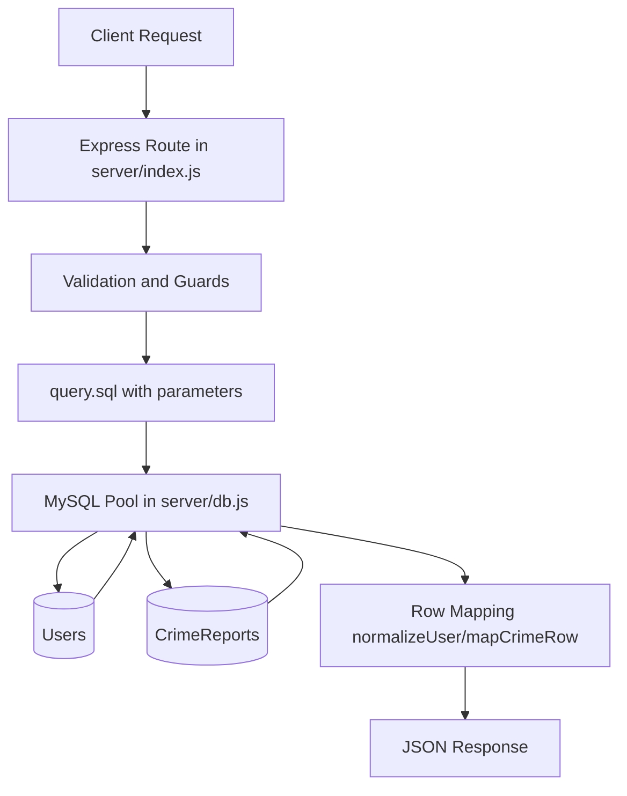
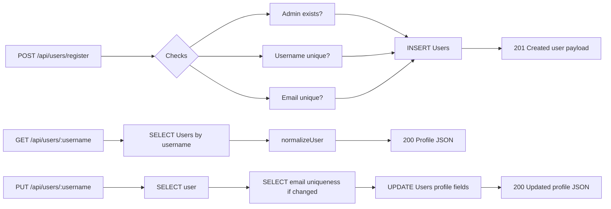
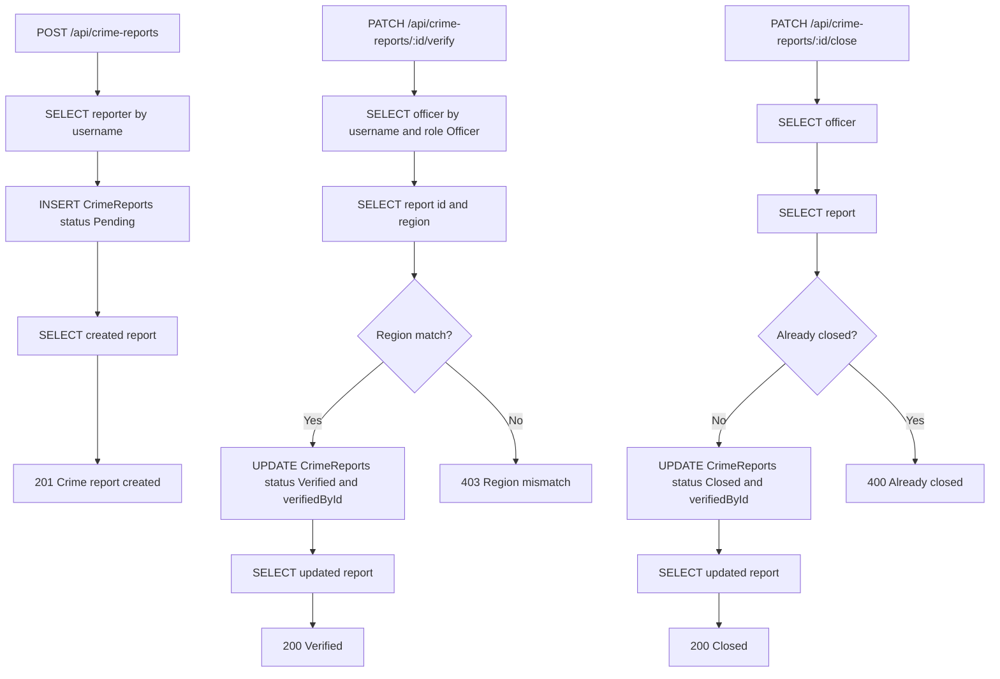
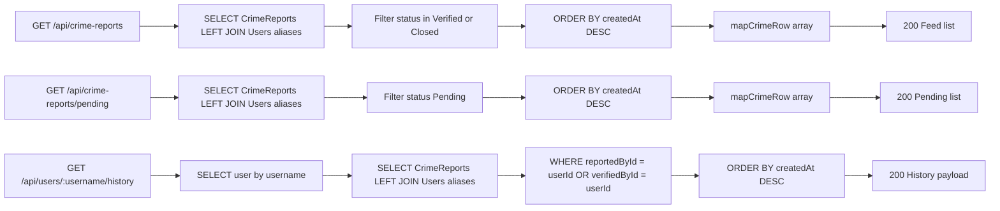
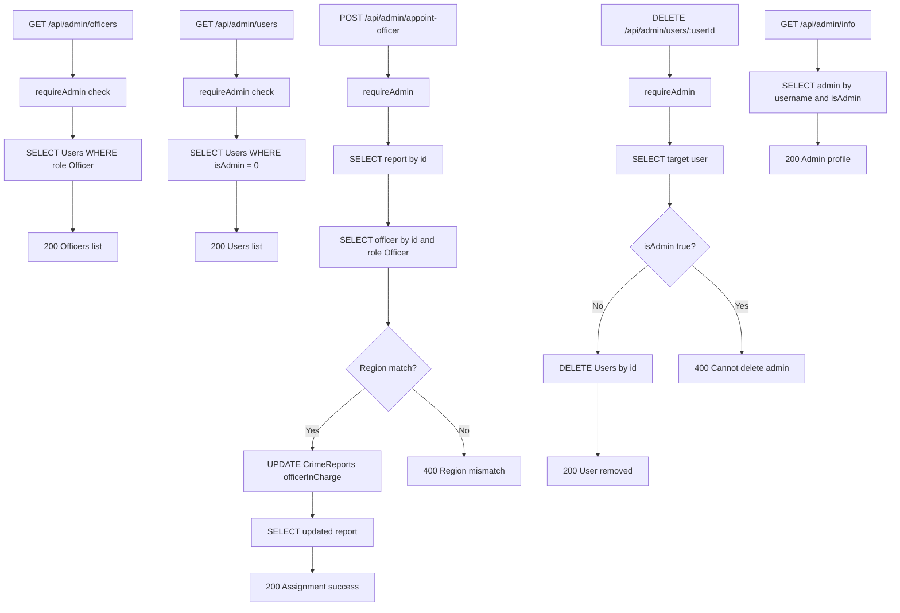

# Crime Matrix Hub 2.0 Query Flow

This page visualizes how API requests move through route handlers, SQL queries, tables, and response payloads.

## 1) Full Backend Data Flow



## 2) Auth and User Flow



## 3) Crime Report Flow



## 4) Feed, Pending, and History Reads



## 5) Admin Management Flow



## 6) Table Touch Matrix

| Route Group | Users Table | CrimeReports Table |
|---|---|---|
| Auth and profile | Read and write | No |
| Crime submit | Read reporter | Insert and read |
| Crime verify and close | Read officer | Read and update |
| Feed and pending | Join-read | Join-read |
| User history | Join-read | Join-read |
| Admin manage officers and users | Read and delete | Update assignment |

## 7) Related Files

- [server/index.js](../index.js)
- [server/db.js](../db.js)
- [server/sql/schema.sql](schema.sql)
- [server/sql/QUERY_MAP.md](QUERY_MAP.md)

## 8) Export Mermaid To PNG

Use Mermaid CLI to render any diagram in this file into PNG for reports/slides.

### One-time install (from project root)

```powershell
npm install --save-dev @mermaid-js/mermaid-cli
```

### Quick export commands (PowerShell)

```powershell
# From project root
Set-Location "e:\Crime-Matrix-Hub-2.0\server\sql"

# Create output folder
New-Item -ItemType Directory -Force -Path ".\diagrams" | Out-Null

# Save each mermaid block into .mmd files, then render:
# Example for one diagram file named flow_auth.mmd
npx mmdc -i .\flow_auth.mmd -o .\diagrams\flow_auth.png -b transparent -s 2
```

### Recommended batch script pattern

Create a PowerShell script named `export-diagrams.ps1` in `server/sql` with:

```powershell
$ErrorActionPreference = "Stop"
Set-Location $PSScriptRoot

New-Item -ItemType Directory -Force -Path ".\diagrams" | Out-Null

$files = Get-ChildItem -Path "." -Filter "*.mmd"
foreach ($f in $files) {
  $out = Join-Path ".\diagrams" ($f.BaseName + ".png")
  npx mmdc -i $f.FullName -o $out -b transparent -s 2
}

Write-Host "Export complete. PNG files are in server/sql/diagrams"
```

Run it:

```powershell
Set-Location "e:\Crime-Matrix-Hub-2.0\server\sql"
powershell -ExecutionPolicy Bypass -File .\export-diagrams.ps1
```
